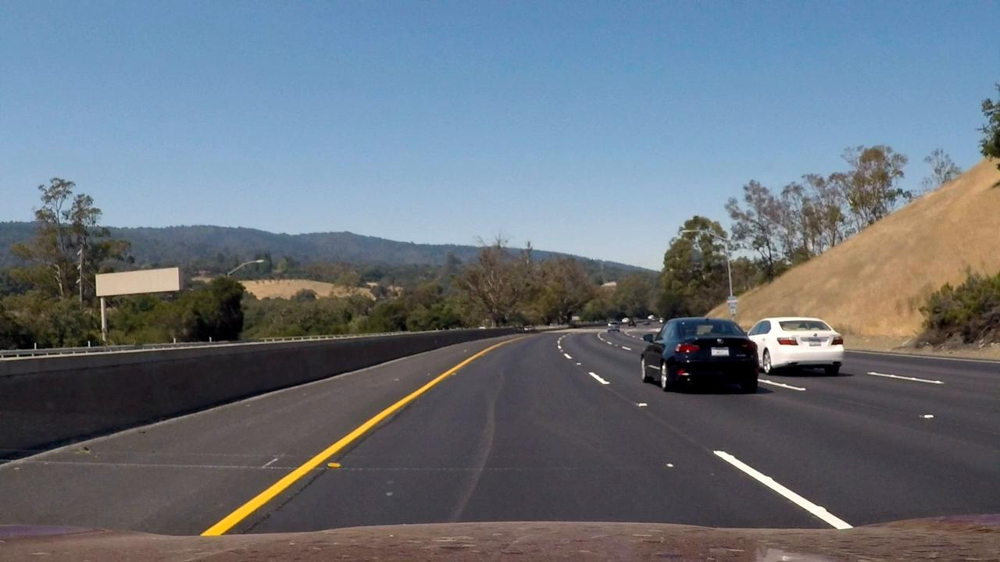
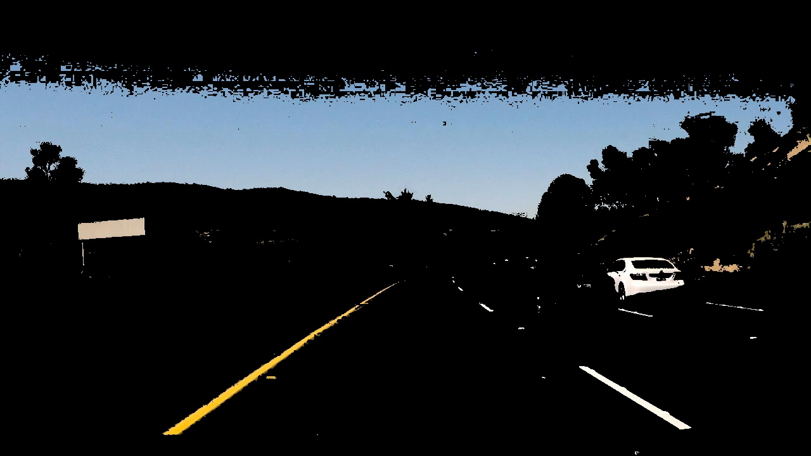
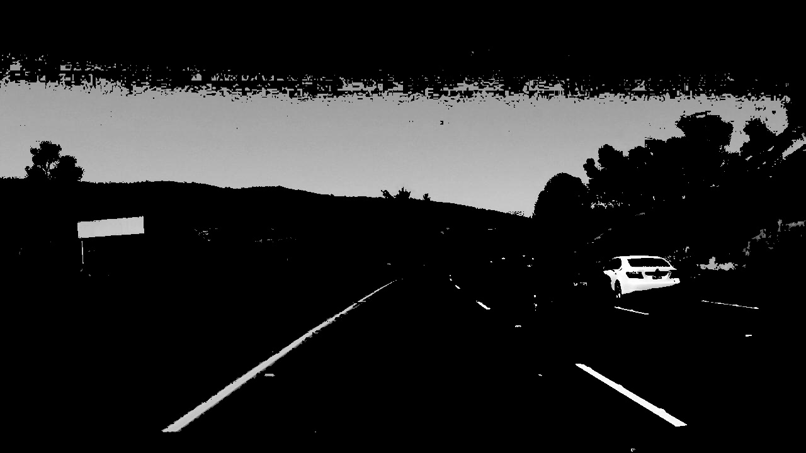
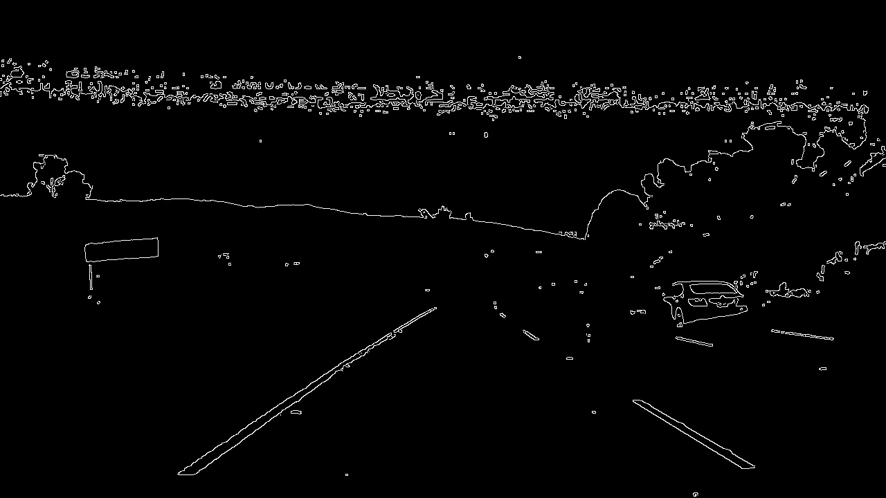
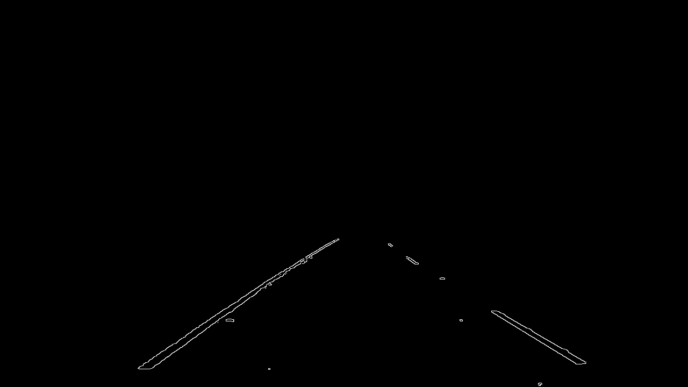
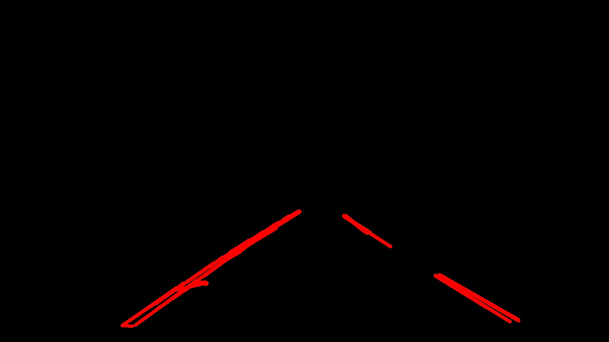
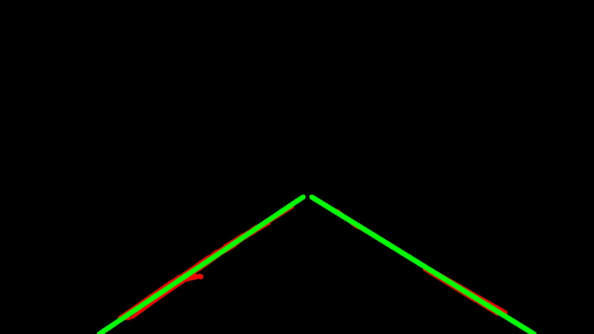
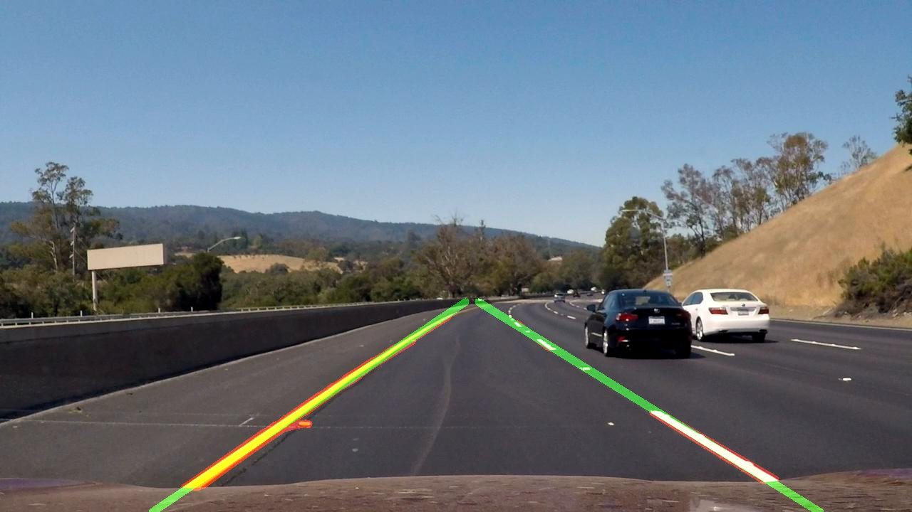

# **Finding Lane Lines on the Road** 

## Yongtao Li

## 02/25/2019

---

**Finding Lane Lines on the Road**

The goals / steps of this project are the following:
* Make a pipeline that finds lane lines on the road
* Reflect on your work in a written report

---

### Reflection

### 1. Describe your pipeline. As part of the description, explain how you modified the draw_lines() function.

My final pipleline that works well for three videos has the following major steps. The code blocks below are just the key functions that have been used. Also here is just an example frame from the challenge clip that demonstrates how the steps work. Please see details of each step and final products in the notebook. 

  * **read in the original image**
  
```python
  image = mpimg.imread(inputfile)
```


  * **retain only yellow and white lines from image**
  
  Initially I don't use this step and the pipeline still works well for the first two video clips. However it's necessary to use this step for the challenge clip. The road divider has different shades that would be misjudged as lane line if not having this step.
  
  Here is [my reference](https://opencv-python-tutroals.readthedocs.io/en/latest/py_tutorials/py_imgproc/py_colorspaces/py_colorspaces.html) that shows how to color space to retain the desired colors.
  
```python
  hsv = cv2.cvtColor(img, cv2.COLOR_RGB2HSV)
  mask1 = cv2.inRange(hsv, np.array([0,0,200]), np.array([150,150,255]))
  mask2 = cv2.inRange(hsv, np.array([20,100,100]), np.array([40,255,255]))
  mask = cv2.bitwise_or(mask1, mask2)
  res = cv2.bitwise_and(img, img, mask = mask)
```


  * **covert the image from RGB to greyscale**
  
```python
  cv2.cvtColor(img, cv2.COLOR_RGB2GRAY)
```

  
  * **smooth the greyscale image using Gaussian smoothing**
  
```python
  cv2.GaussianBlur(img, (kernel_size, kernel_size), 0)
```

  
  * **apply Canny to find edge**
  
```python
  cv2.Canny(img, low_threshold, high_threshold)
```

  
  * **retain edges only in a region of interest**
  
```python
  cv2.fillPoly(mask, vertices, ignore_mask_color)
  masked_image = cv2.bitwise_and(img, mask)
```

  
  
  * **transfer edges in to Hough space to find lines and draw them in red**
  
```python
 lines = cv2.HoughLinesP(img, rho, theta, threshold, np.array([]), minLineLength=min_line_len, maxLineGap=max_line_gap)
```


  * **group left and right lines by slope**
  
```python
  slope =  (y2-y1)/(x2-x1)
  if slope < 0 and x1 < img.shape[1]*0.5 and x2 < img.shape[1]*0.5 :
     fittedlines[0].append([x1,y1])
     fittedlines[0].append([x2,y2])
  elif slope > 0 and x1 > img.shape[1]*0.5 and x2 > img.shape[1]*0.5 :
     fittedlines[1].append([x1,y1])
     fittedlines[1].append([x2,y2])
```
  
  * **fit group of lines into 2 straight left and right lane lines**

```python
    [line1_vx,line1_vy,line1_x,line1_y] = cv2.fitLine(np.array(fitline, dtype=np.int32), cv2.DIST_L2,0,0.01,0.01)
```

  * **draw the 2 straight green lines through the region of intrest**

```python
    bot = (int(line1_x + (line1_vx/line1_vy)*(img.shape[0]-line1_y)), int(img.shape[0]))
    top = (int(line1_x + (line1_vx/line1_vy)*(img.shape[0]*0.59-line1_y)), int(img.shape[0]*0.59))
    cv2.line(img, bot, top, color=[0,255,0], thickness=10)
```


  * **overlay the straight lines on original image with half transparency**
  
```python
    cv2.addWeighted(initial_img, α, img, β, γ)
```
  



### 2. Identify potential shortcomings with your current pipeline

Here are a few shortcomings that I could think of and I'm pretty sure there will be more:

  * I used straight line to fit lines from Hough transform. It might not doing a good job if the lane lines are not that straight. Also not every road is as flat as in these three test video clips.
  
  * I used yellow and white to retain lane lines, but I gues not every lane lines are just yellow and white. Also the road might only have one lane line and the other side is just a curb or divider.
  
  * I used a region of interest which is pretty much prescribed for shape and location. Different camera angle and location might result in totally different kind of region of interest.

### 3. Suggest possible improvements to your pipeline

  * How to group left and right lines could be better. Right now I just simply use the slope and divide them in the middle. A more statistical way might be worth trying to classify left and right lines.
  
  * The color selection for yellow and white lines could be better too. The threshold for HSV color space might be worth fine tunning. Other color spaces might be worth trying as well.
  
  * All the shortcomings above are really worth for further improvements. Probably I need more advanced computer vision tools to address them.
